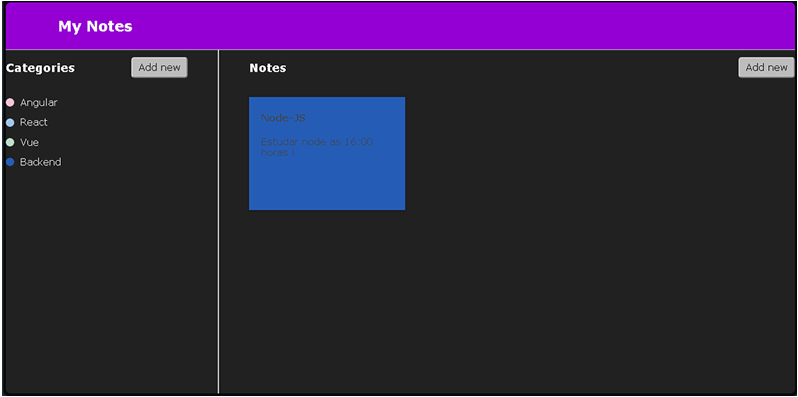

# Desafio Angular My Notes
 ### Desafio 2° proposto pelo colega [Rafael](https://github.com/rpaivabr) do grupo de estudos de frontend.

Sabemos a importância da aplicação se comunicar com uma API para ler e persistir informações. Ao compartilhar a mesma API com mais pessoas, ganhamos conectividade e reaproveitamento da mesma informação, mesmo com diferentes aplicações front-end.

Usando como referência nossos estudos anteriores, neste projeto vamos criar uma aplicação que nos permite criar notas (post-its) por categorias, bem como criar novas categorias..
  
Para isso, temos a dependência de desenvolvimento já instalada (json-server), e para rodar, basta o comando `npm run api`, e a api estará funcionando no endereço http://localhost:3333):

## Configuração inicial.

- [x] Arquivos para o json-server: `/api/db.json` , script para rodar api: `npm run api`
- [x] Arquivo de estilo css [Normalize](https://necolas.github.io/normalize.css/)  já na pasta `/assets` e importado index.html (reset)
- [x] Estrutura inicial do html no arquivo `/src/app/app.component.html` e algumas classes já dadas no css global `styles.css` (caso queiram modificar e melhorar, fiquem a vontade, apenas uma sugestão inicial)

## Restrições

- [x] Somente utilizar componentes (não pode ainda usar serviços)
- [x] Não pode usar nenhuma lib UI de css, apenas seus próprios css
- [x] Utilizar metodo fetch (asíncrono) para requisições HTTP (métodos GET, POST, PUT e DELETE), ou o HttpClientModule
- [x] Manter chamadas de APIs apenas no componente principal (app component) e não em outros componentes

# Layout 

## Features

- [ ] Criar componentes ao seu critério, havendo pelo menos 2 componentes além do componente principal
- [ ] Buscar da API pela lista de categorias e notes já salvos
- [ ] Ao clicar em botão de adicionar novo note, abrir um dialog (popup) solicitando ao usuário preencher:  `title`(input text), `content`(textarea) e `categoryId`(select), e dar a opção de criar, ou fechar o dialog
- [ ] Ao clicar em botão de adicionar nova categoria, abrir um dialog (popup) solicitando ao usuário preencher:  `name`(input text) e `color`(input text), e dar a opção de criar, ou fechar o dialog
- [ ] Ao clicar sobre algum note ou categoria, abrir os respectivos modais já preenchidos, com o valor do elemento selecionado, e dar a opção de alterar, ou fechar o dialog

## Extra Features
- [ ] Alterar a cor do dialog do note / categoria durante a seleção da cor / categoria
- [ ] Opção do usuário ao editar note, também poder deletar o note (solicitando confirmação primeiro)
- [ ] Melhorias que quiser na interface (componentes / css / html)

## Links Úteis

- [Fetch API](https://developer.mozilla.org/en-US/docs/Web/API/Fetch_API/Using_Fetch)
- [Thunder Client VSCode Ext](https://marketplace.visualstudio.com/items?itemName=rangav.vscode-thunder-client)
- [Json-server](https://github.com/typicode/json-server)  
- [Normalize](https://necolas.github.io/normalize.css/)  

## Projetos para Referência

- [Usando GET e POST com fetchAPI](https://www.youtube.com/watch?v=CXLsvT9mSo8)
- [Stackblitz html-dialog](https://stackblitz.com/edit/angular-ivy-2dno9p)

<!-- ### Visão do Layout final
 -->
